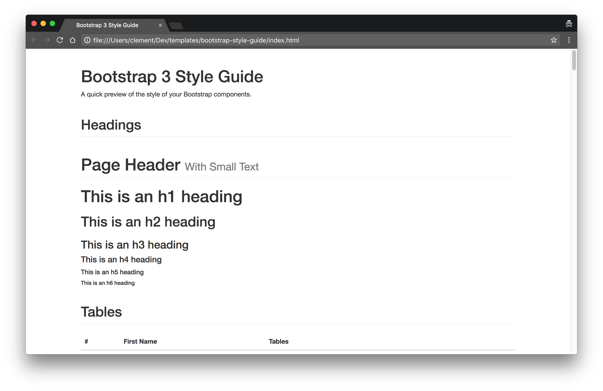

# Bootstrap 3 Style Guide

A simple style guide for [Bootstrap 3](http://getbootstrap.com/) to let you have a quick preview of the style of your Bootstrap components.




## Usage

Add your css file(s) in the ``index.html`` file to see how Bootstrap components look using your custom style.

``` html
<link href="style.css" rel="stylesheet">
```
